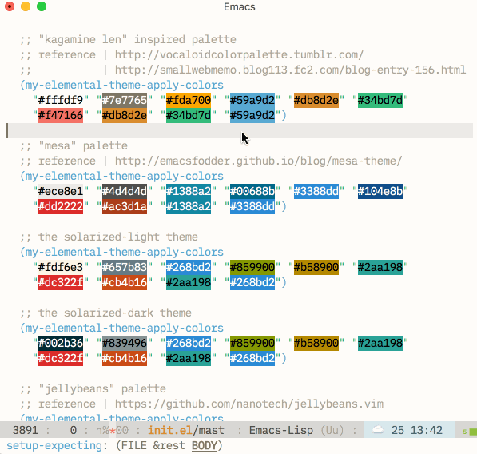
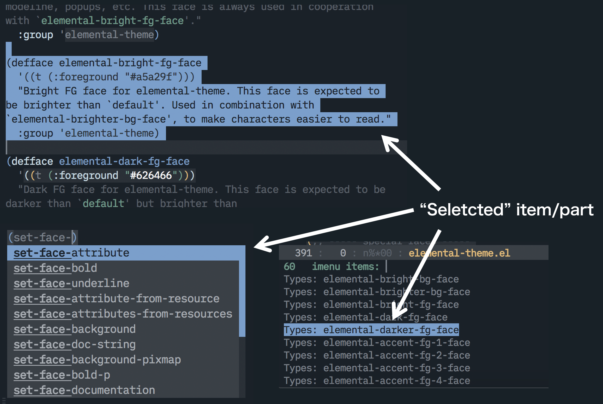
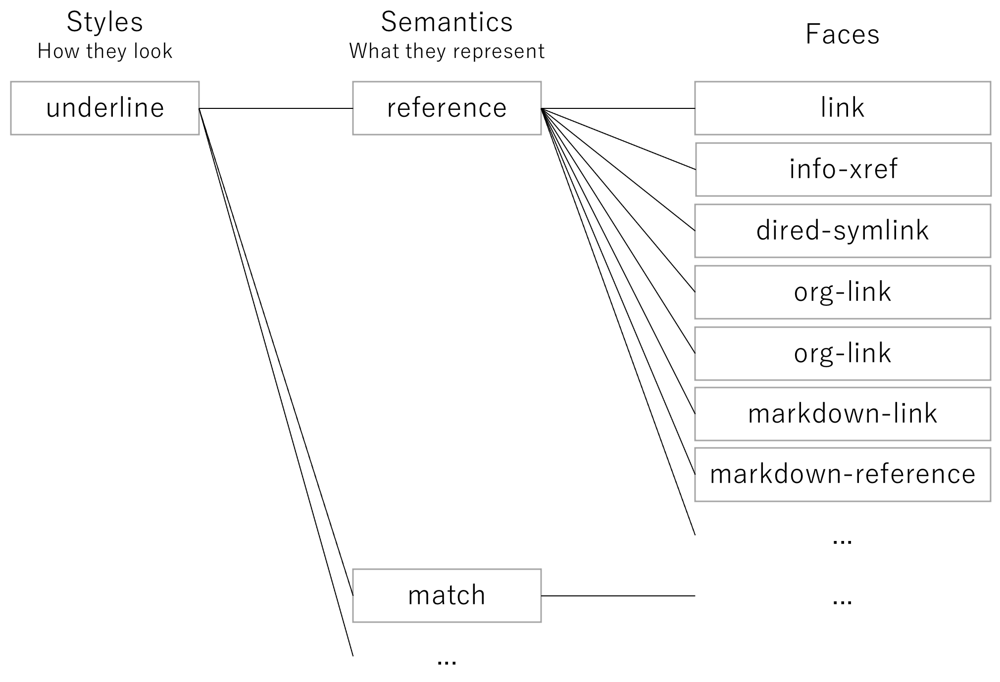

## Elemental-theme

An Emacs color theme well organized with the built-in inheritance
mechanism.

Meant to be ...

### 1. Easy to customize

You choose colors. `elemental-theme` maps the colors to faces.



### 2. Consistent

Same meaning, same look. Designed to be intuitive.



## Installation

Add elemental-theme.el to the load-path, and enable the theme.

```
(require 'elemental-theme)
(enable-theme 'elemental-theme)
```

## Customization

Following faces are called "elemental" in this theme.

All other supported faces are derived from these faces, so you can
easily create your own look by just editing these "elemental" faces.

You may use `M-x describe-face` for more detailed descriptions of each
faces.

Core faces:

- `default` (built-in)
- `cursor` (built-in)

Brightness variations:

- `elemental-bright-bg-face`
- `elemental-brighter-bg-face`
- `elemental-bright-fg-face`
- `elemental-dark-fg-face`
- `elemental-darker-fg-face`

Accents:

- `elemental-accent-fg-1-face`
- `elemental-accent-fg-2-face`
- `elemental-accent-fg-3-face`
- `elemental-accent-fg-4-face`

Color-specific faces:

- `elemental-red-fg-face`
- `elemental-blue-fg-face`
- `elemental-green-fg-face`
- `elemental-orange-fg-face`

To customize these elemental faces, functions like
`set-face-background`, `set-face-foreground` and `set-face-attribute`
are useful.

``` emacs-lisp
;; 'red' means '#ff3333' in this face
(set-face-foreground 'elemental-red-fg-face "#ff3333")
```

Following faces are considered "elemental" too, but you usually don't
need to modify:

- `bold` (built-in)
- `italic` (built-in)
- `underline` (built-in)
- `elemental-red-underline-face`
- `elemental-yellow-underline-face`
- `elemental-inverse-video-face`

### Naming conventions
#### `-fg-` faces and `-bg-` faces

If an elemental face contains `-fg-` in its name, it's considered a
"foreground face". `-bg-` stands for "background" face respectively.

You usually want to set a foreground color for a foreground face, and
a background color for a background face:

``` emacs-lisp
(set-face-background 'elemental-bright-bg-face "#222233")
(set-face-foreground 'elemental-brighter-fg-face "#ffffff")
```

`elemental-theme` does not use more than one foreground faces (or
background faces) for the same part of a text. But `elemental-theme`
may combine one foreground face and one background face together for
the same part of a text. You may put any styles for "elemental" faces,
but foreground faces should not conflict with any other background
faces (and vice-versa).

#### Color-specific faces

Some elemental faces contain specific color names in their face names
(like `elemental-red-fg-face`).

In the context of user interfaces, some colors may imply special
meanings:

- red ... danger, error, deletion, inhibited etc
- yellow ... warning, change etc
- green ... safe, success, addition etc
- blue ... information, allowed etc

If an elemental face contains a specific color name,
`elemental-red-fg-face` for an example, it is usually expected to look
reddish and used to highlight erorrs etc.

If you have a reddish color in `accent-*` faces, it's okay to reuse
the color:

``` emacs-lisp
;; `accent-1' face is reddish in our theme, so reuse the color for `red` face too
(set-face-foreground 'elemental-red-face (face-foreground 'elemental-accent-fg-1-face))
```

## Semantic faces



In addition to the "elemental" faces, `elemental-theme` also defines
some utility faces (called "semantic" faces). For an example,
`org-link` and `markdown-link-face` both inherit the same "semantic"
face `elemental-reference`, which is then derived from some
"elemental" faces (`underline` specifically).

"semantic" faces provides an abstraction layer of faces based on
semantics (meanings), which helps adding support to new packages in a
consistent way, and keep the theme organized (kinda like "molecule"s
in "Atomic Design").

Moreover, `elemental-theme` does not inhibit users to modify these
"semantic" faces. You may redefine how `reference` should look like,
if you want (make it italic, instead of underlined, for an example).

Following faces are called "semantic" in this theme.

You may use `M-x describe-face` for more detailed descriptions of each
faces.

Basic:

- `elemental-caution`
- `elemental-diminished`
- `elemental-highlight`
- `elemental-inappropreate`
- `elemental-incorrect`
- `elemental-key`
- `elemental-match`
- `elemental-match-interactive`
- `elemental-reference`
- `elemental-selected`

Differences (NOT only for the `diff-mode`™️):

- `elemental-diff-added`
- `elemental-diff-changed`
- `elemental-diff-refine-added`
- `elemental-diff-refine-changed`
- `elemental-diff-refine-removed`
- `elemental-diff-removed`

Filenames:

- `elemental-file-executable`
- `elemental-file-name`
- `elemental-file-special`

Indicators:

- `elemental-indicator-error`
- `elemental-indicator-info`
- `elemental-indicator-success`
- `elemental-indicator-warning`

Nested structures:

- `elemental-level-1`
- `elemental-level-2`
- `elemental-level-3`
- `elemental-level-4`
- `elemental-stage-1`
- `elemental-stage-higher`
- `elemental-stage-negative`

Markups:

- `elemental-markup-code`
- `elemental-markup-table`

Codes:

- `elemental-syntax-builtin`
- `elemental-syntax-literal`
- `elemental-syntax-symbol`
- `elemental-syntax-type`

UI components:

- `elemental-ui-component`
- `elemental-ui-component-diminished`
- `elemental-ui-component-transparent`
- `elemental-ui-ghost`
- `elemental-ui-prompt`

## Policies

Please follow the policies below when adding support to new packages.

### Consistent

All supported faces (except for the "elemental" and "semantic" faces)
must be derived from exactly one "semantic" face (or the `default`
face). We neither put any styles directly to a face, nor make more
than two inheritances for a single face.

When a face inherits a semantic face, the face's "meaning" must fit
the description of the semantic face (i.e. You CANNOT use
`elemental-selected` just for its style. You CAN use
`elemental-selected` face only if it's actually a selected item).

If you find that there's no suitable semantic face for the purpose,
it's okay to add a semantic face by deriving some "elemental" or
"semantic" faces. Note that we do not put any styles directly to a
semantic face.

### Distinguishable

`elemental-theme` defines MANY semantics faces, and it's nearly
impossible to put unique styles to all the semantic faces. So in
`elemental-theme`, it's okay to put the same style to more than one
semantic faces (i.e. it's okay that `elemental-markup-table` and
`elemental-syntax-literal` look the same).

But, if two different semantic faces (often) appear in the same buffer
(or the same UI element, like popups), it's not okay to put the same
style to these faces. For an example, `elemental-markup-code` and
`elemental-markup-table` are both used to highlight markup files. So
they should look different (to avoid ambiguity).

## Related works

- `base16-emacs`
- `emacs-color-theme-solarized`

They both have ability to generate a color theme from a color palette,
so that they can act like "color theme framework"s.

`elemental-theme` is, unlike these theme frameworks, just a "color
theme" which is well organized with the built-in inheritance
mechanism. So `elemental-theme` can be customized dynamically (without
need to "re-generate" the theme when you make changes), and works well
with not just colors but any face attributes like `bold`, `italic`
etc.

`elemental-theme` also has an abstraction layer called "semantic"
faces, which enhances extensiblity & customizablity in a consistent
way.
